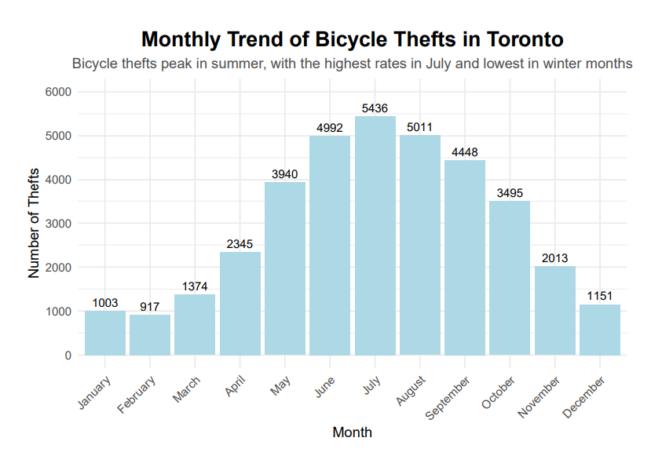
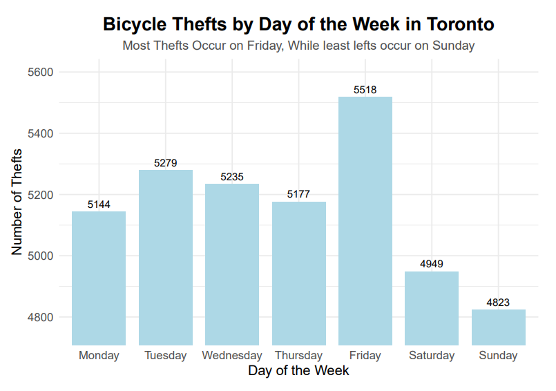
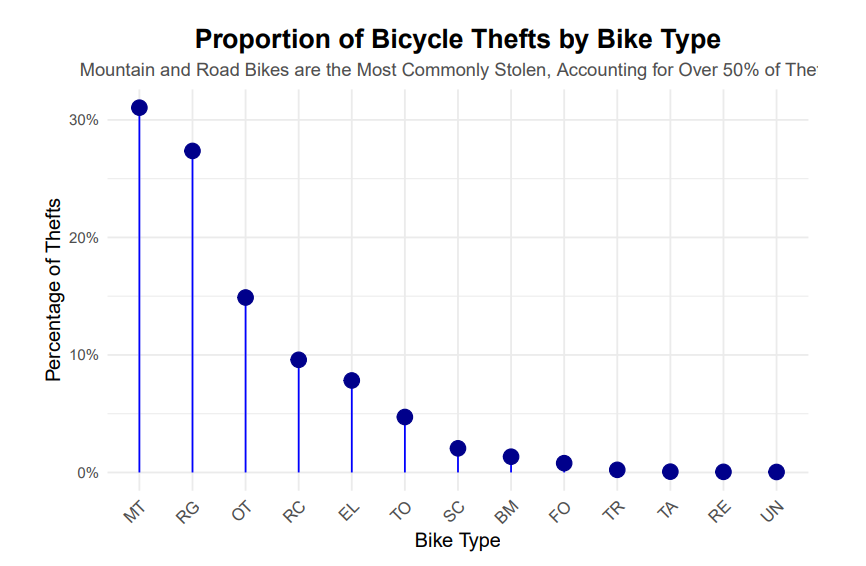
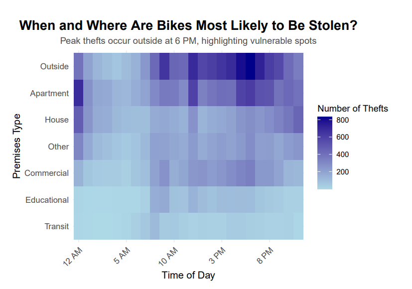
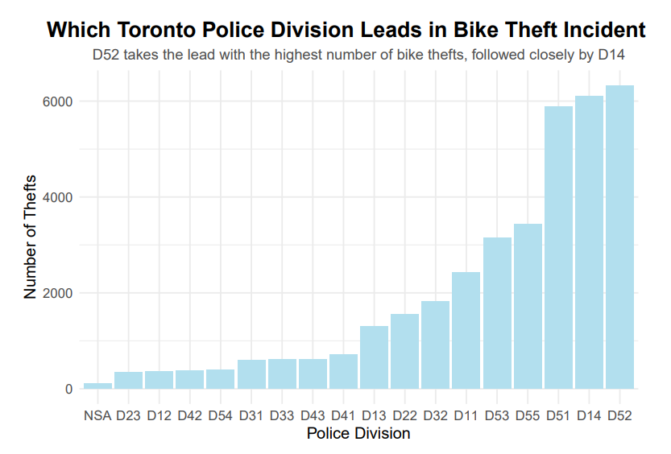
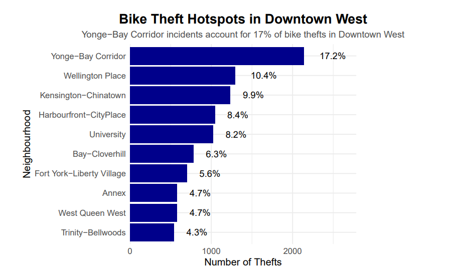

# Toronto-Bicycle-Theft-Analysis

An exploratory data project examining when, where, and which bicycles are most frequently stolen in Toronto. The analysis highlights seasonal patterns, high-risk locations, and theft trends using publicly available police data.

## Dataset

This project uses the Bicycle Thefts Open Data provided by the Toronto Police Service.  
Official source: https://data.torontopolice.on.ca/datasets/TorontoPS::bicycle-thefts-open-data/about  

A local copy of the dataset is included in this repository:  
[`data/Bicycle_Thefts_Open_Data.csv`](data/Bicycle_Thefts_Open_Data.csv)

The dataset contains over 36,000 reported bicycle thefts, including variables such as theft date, report date, premise type, police division, neighborhood, and bike type.

## Executive Summary

This project analyzes reported bicycle thefts in Toronto to identify when, where, and what types of bikes are most frequently stolen. The analysis shows that thefts peak in the summer months, especially July, and decrease significantly during winter. Fridays see the highest number of thefts, while Sundays see the least. There are clear spikes around midday and early evening.

Mountain and road bicycles are the most frequently stolen types. The downtown core—particularly police divisions D52, D14, and D51—contains the highest concentration of theft incidents. These results can support cyclists, city planners, and law enforcement in understanding risk patterns and improving prevention strategies.

Monthly Trend of Bicycle Thefts  

Bicycle Thefts by Day of the Week  

Most Common Bike Types Stolen  

## Business Problem

Bicycle theft is a persistent issue in Toronto, affecting thousands of cyclists annually and creating financial loss and safety concerns. Without understanding the patterns behind theft occurrences, it is difficult to develop effective prevention strategies or allocate resources efficiently.

This project addresses the following questions:
- When are thefts most likely to occur?
- Where in the city are they concentrated?
- Which bike types are most frequently targeted?
- How can these insights support theft prevention and planning?

## Methodology

- Cleaned and standardized theft records (dates, times, bike types, premise types)
- Analyzed trends across months, weekdays, and hours of the day
- Examined theft distribution across police divisions and downtown neighborhoods
- Summarized bike type frequencies and high-risk categories
- Created visual summaries using R and ggplot2

Thefts by Time and Location  

Bicycle Thefts by Police Division  

Bike Theft Hotspots in Downtown West  

## Skills

- Data cleaning and preparation  
- Exploratory data analysis  
- Data visualization and interpretation  
- Public safety and geographic trend analysis  
- Clear communication of analytical findings  

